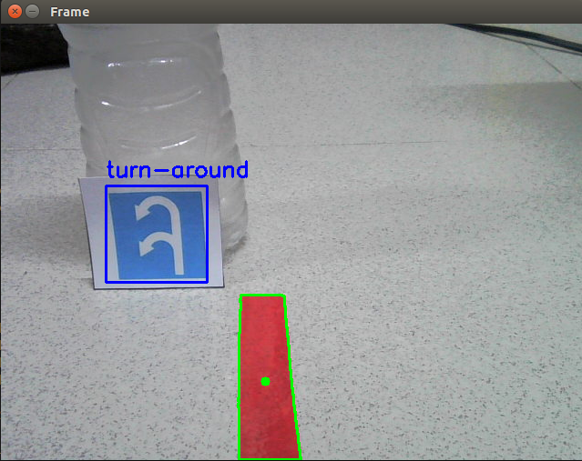
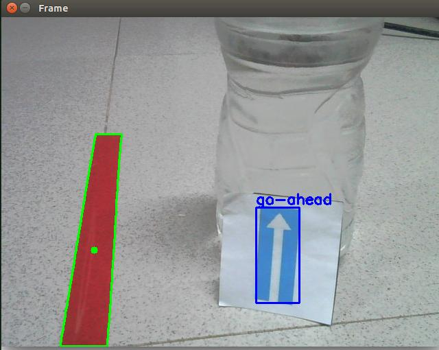
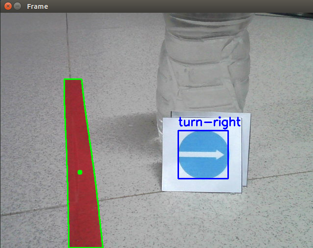

### INTRODUCTION
This project using for studying a self-driving detecting some sign traffics. Currently, the robot can only run as a conceptual model, it cannot yet run in real-time because the control and recognition programs have not been optimized.

### Traffic sign detection using YOLOv5





### How to use my code
**Clone my repo:**
```bash
git clone https://github.com/minhthong2514/TheSimpleSelfDriving.git
```

